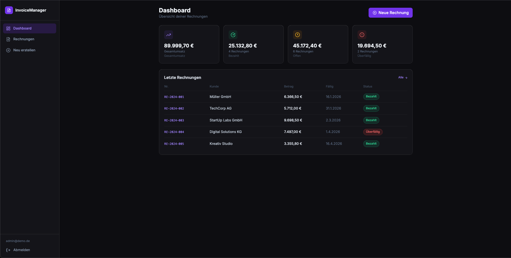
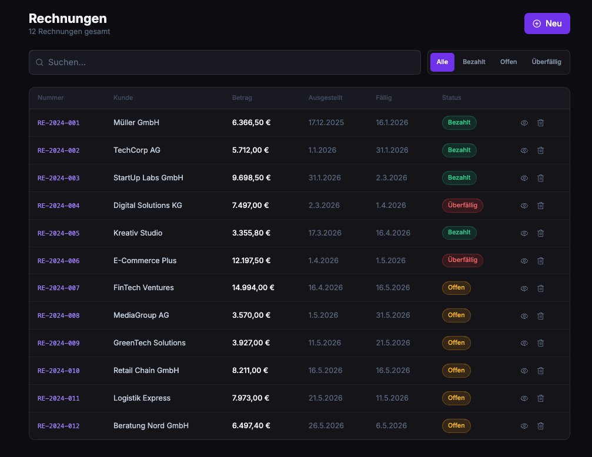
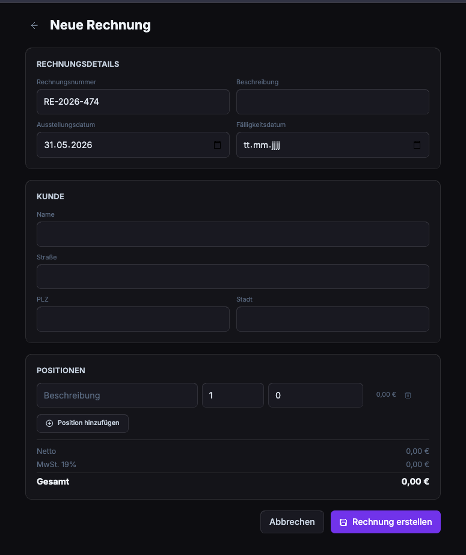
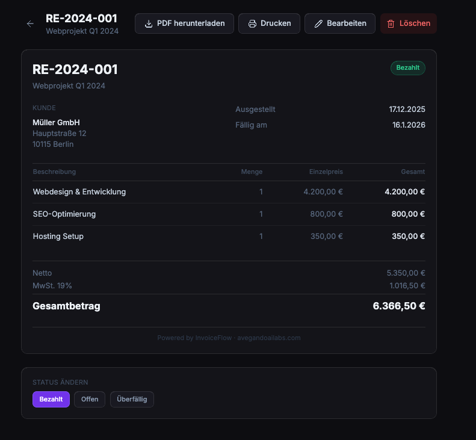
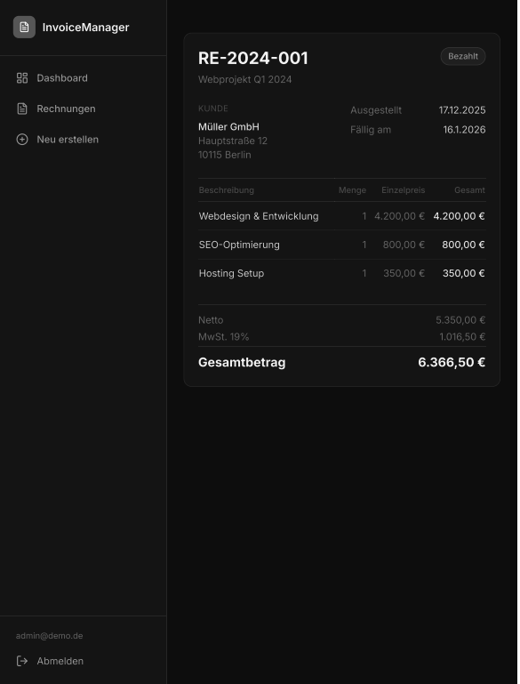
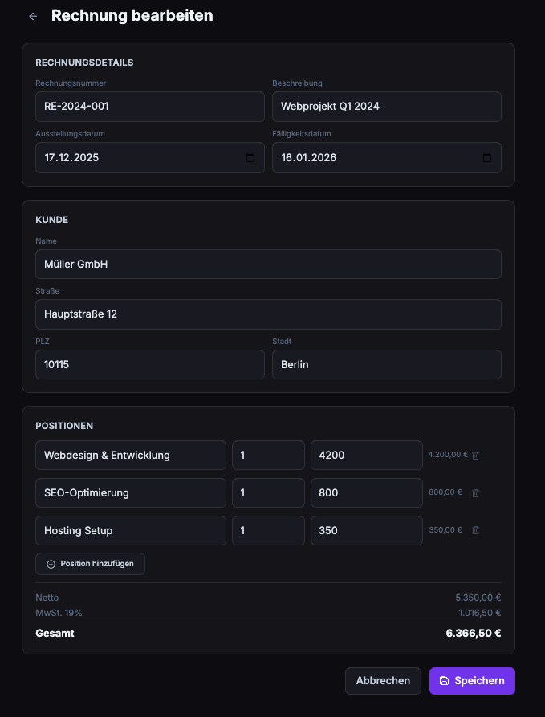

<div align="center">

```
 ██╗███╗   ██╗██╗   ██╗ ██████╗ ██╗ ██████╗███████╗███████╗██╗      ██████╗ ██╗    ██╗
 ██║████╗  ██║██║   ██║██╔═══██╗██║██╔════╝██╔════╝██╔════╝██║     ██╔═══██╗██║    ██║
 ██║██╔██╗ ██║██║   ██║██║   ██║██║██║     █████╗  █████╗  ██║     ██║   ██║██║ █╗ ██║
 ██║██║╚██╗██║╚██╗ ██╔╝██║   ██║██║██║     ██╔══╝  ██╔══╝  ██║     ██║   ██║██║███╗██║
 ██║██║ ╚████║ ╚████╔╝ ╚██████╔╝██║╚██████╗███████╗██║     ███████╗╚██████╔╝╚███╔███╔╝
 ╚═╝╚═╝  ╚═══╝  ╚═══╝   ╚═════╝ ╚═╝ ╚═════╝╚══════╝╚═╝     ╚══════╝ ╚═════╝  ╚══╝╚══╝
```

### 🧾 Professional Invoice Management — Free, Open Source, Zero Backend

[](https://react.dev)
[](https://typescriptlang.org)
[](https://vitejs.dev)
[](https://tailwindcss.com)
[](./LICENSE)

**Built with ❤️ by [Avegando AI Labs](https://www.avegandoailabs.com)**

</div>

---

## 📸 Screenshots

| Dashboard | Invoice List |
|-----------|-------------|
|  |  |

| Create Invoice | Invoice Detail |
|---------------|----------------|
|  |  |

| Print View | Mobile Edit |
|-----------|-------------|
|  |  |

---

## ✨ Features

| Feature | Description |
|---------|-------------|
| 📊 **Dashboard** | Live revenue stats — total, paid, pending, overdue |
| 📋 **Invoice List** | Filter by status, full-text search, instant sort |
| ➕ **Create & Edit** | Line items, VAT 19%, due dates, client address |
| 🖨️ **Print-Ready** | One-click `window.print()` with clean print layout |
| 🔐 **Auth** | Simple login, session in localStorage |
| 💾 **Zero Backend** | All data in localStorage — works offline, no server |
| 🎨 **Premium Dark UI** | Violet accent, Inter font, lucide-react icons |
| 📱 **Responsive** | Works on desktop, tablet & mobile |

## 🚀 Quick Start

```bash
git clone https://github.com/avegando/invoice-manager
cd invoice-manager
npm install
npm run dev
```

Open **http://localhost:5173** and log in with the demo credentials.

## 🔑 Demo Credentials

```
Email:    admin@demo.de
Password: admin123
```

## 🛠️ Tech Stack

```
React 18 + TypeScript  →  UI & type safety
Vite 5                 →  instant dev server + optimized builds
Tailwind CSS 3         →  utility-first styling
lucide-react           →  consistent icon set
react-router-dom v6    →  client-side routing
localStorage           →  zero-config persistence
```

## 📁 Project Structure

```
invoice-manager/
├── src/
│   ├── components/
│   │   ├── Layout/        # Sidebar, AppLayout
│   │   └── UI/            # StatusBadge (reusable)
│   ├── context/           # AuthContext, InvoiceContext
│   ├── pages/             # Login, Dashboard, List, Form, Detail
│   ├── types/             # Invoice, LineItem, AuthUser interfaces
│   └── utils/             # storage.ts, seed.ts, format.ts
├── tailwind.config.js
├── vite.config.ts
└── package.json
```

## 📄 License & Attribution

This project is licensed under the **MIT License with Attribution**.

You are free to:
- ✅ Use this project commercially
- ✅ Modify and distribute it
- ✅ Include it in your own products

**One condition:** You must include a visible backlink to the original creator:

```
Powered by InvoiceFlow — Built by Avegando AI Labs (https://www.avegandoailabs.com)
```

See [LICENSE](./LICENSE) for full terms.

---

<div align="center">

**Made possible by [Avegando AI Labs](https://www.avegandoailabs.com)**
*Building AI-powered tools that actually work.*

⭐ If this saved you time, a star means a lot!

</div>
